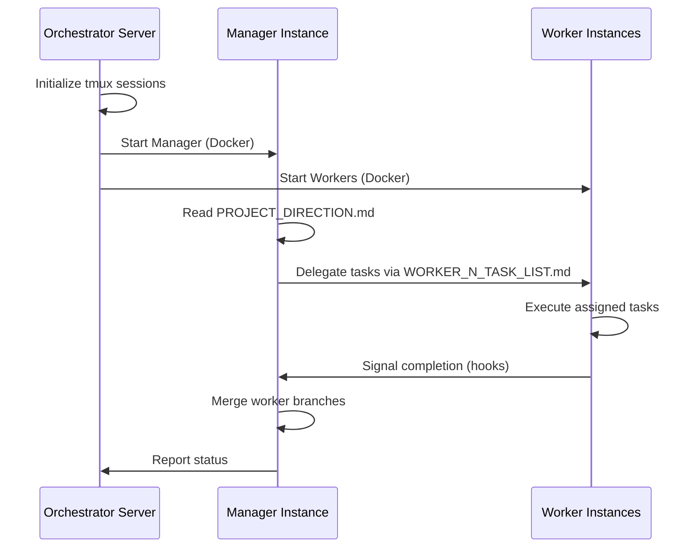

# Claude Code Orchestrator

> A distributed system for orchestrating multiple Claude Code instances to work collaboratively on software projects.


## Overview

The Claude Code Orchestrator manages parallel Claude Code instances through a Node.js server, enabling coordinated development workflows at scale. A dedicated **Manager** instance delegates tasks to **Worker** instances, each running in isolated Docker containers.


## Prerequisites

| Tool | Version | Purpose |
|------|---------|---------|
| Node.js | v24+ | Server runtime |
| Docker | Latest | Container isolation |
| tmux | Latest | Session management |
| Git | Latest | Version control & worktrees |


## Configuration

### Config Directory

The orchestrator reads all configuration from an external directory that is **not checked into version control**. This keeps secrets (API keys, OAuth tokens) secure.

```
node server.js --config /path/to/config-dir
```

### Directory Structure

```
/path/to/config-dir/
└── orchestrator.json          # Main orchestrator settings
```

### `orchestrator.json`

```json
{
  "repositoryUrl": "https://github.com/org/repo.git",
  "branch": "main",
  "workerCount": 3,
  "claudeConfigs": "~/claude-configs/*.json"
}
```

| Field | Description | Required | Default |
|-------|-------------|----------|---------|
| `repositoryUrl` | Git repository URL to orchestrate | Yes | — |
| `branch` | Target branch name | No | `main` |
| `workerCount` | Number of parallel worker instances | Yes | — |
| `claudeConfigs` | Glob pattern to Claude Code credential files | Yes | — |

> **Note**: Provide more config files than workers to enable automatic rotation when rate limits are hit.

### Security

- **Never commit** the config directory to version control
- Add config paths to `.gitignore`
- Use environment variables or secret managers in production
- Configs are mounted read-only into Docker containers

---

## Architecture

```
┌─────────────────────────────────────────────────────────┐
│                 Orchestrator (Node.js)                  │
│  • Lifecycle management  • Rate limit handling          │
│  • Config swapping       • Health monitoring            │
└─────────────────────┬───────────────────────────────────┘
                      │
          ┌───────────┴───────────┐
          ▼                       │
┌─────────────────────┐           │
│  Manager Instance   │           │
│  (Docker + tmux)    │           │
│  • Task delegation  │           │
│  • Branch merging   │           │
│  • Conflict handling│           │
└─────────┬───────────┘           │
          │                       │
    ┌─────┴─────┬─────────┐       │
    ▼           ▼         ▼       │
┌────────┐ ┌────────┐ ┌────────┐  │
│Worker 1│ │Worker 2│ │Worker N│◄─┘
│(Docker)│ │(Docker)│ │(Docker)│
└────────┘ └────────┘ └────────┘
```


## How It Works

### Core Mechanism

1. **Server Initialization**: The Node.js server starts and spawns tmux sessions, each running a Docker container with a Claude Code instance via Docker Compose.

2. **Hook-Based Communication**: Claude Code instances use [hooks](https://docs.anthropic.com/en/docs/claude-code/hooks) (e.g., `Stop`) to communicate with the orchestrator, enabling dynamic task management and coordination.

3. **Subscription Management**: The orchestrator monitors rate limits across Claude Code subscriptions. When a subscription hits its limit, it automatically swaps `claude/settings.json` to use an available subscription.

### Required Repository Files

| File | Purpose |
|------|---------|
| `PROJECT_DIRECTION.md` | High-level project goals and direction for the Manager |
| `WORKER_{N}_TASK_LIST.md` | Task assignments for each worker (version controlled) |

---

## Workflow



### Step-by-Step

1. **Start** — Launch the Node.js orchestrator server
2. **Initialize** — Server creates tmux sessions with Docker containers, injecting environment variables (`WORKER_ID`, `TOTAL_WORKERS`, etc.)
3. **Coordinate** — Manager reads `PROJECT_DIRECTION.md` and delegates tasks to workers
4. **Execute** — Workers perform tasks and communicate progress via hooks
5. **Merge** — Manager integrates worker branches into the main branch

---

## Design Principles

### Efficiency
- **Zero idle time**: Manager maintains a task queue to keep all workers continuously productive
- **Parallel execution**: Workers operate independently on isolated branches/worktrees

### Communication
- **Hooks-first**: Prefer Claude Code hooks for instance-to-server communication
- **Fallback**: Use `tmux send-keys` when direct commands are necessary

### Reliability
- **Auto-recovery**: Server monitors container health and restarts crashed instances
- **Graceful degradation**: Retry mechanisms for failed tasks
- **Conflict resolution**: Manager handles merge conflicts during branch integration

### Observability
- **Logging**: Comprehensive logs for all instance activities
- **Monitoring**: Real-time status tracking for instances and overall orchestration health

---

## References

- [Claude Code Hooks Documentation](https://docs.anthropic.com/en/docs/claude-code/hooks)


